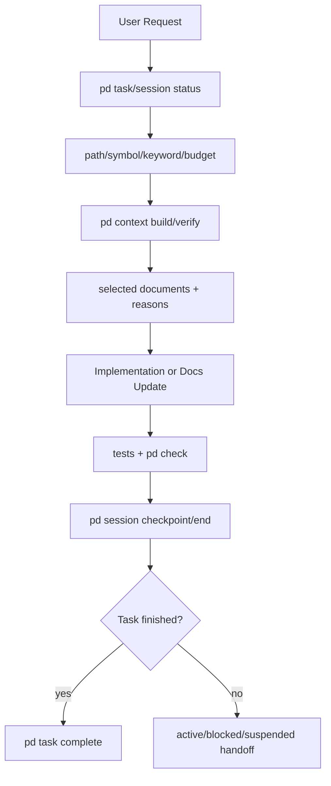

# Overview

Project Paradigma 是一个 OKF-compatible Agent Memory Runtime Framework。它用 Markdown + YAML frontmatter 维护长期知识，用 runtime/logs/knowledge 三态结构区分当前状态、过程记录和可复用知识，并用 `.paradigma/tools/` 中的确定性工具做最小校验和索引同步。

# Technology Stack

| Layer | Choice | Notes |
|-------|--------|-------|
| Knowledge format | OKF-compatible Markdown | Concept 文档使用 YAML frontmatter，至少包含非空 `type` |
| Runtime protocol | `AGENT_RULES.md` + IDE adapters | `AGENT_RULES.md` 是协议源头，Cursor rule 是适配器 |
| Tooling | Python 3.11+ + PyYAML 6.x | 统一 SafeLoader 解析 YAML/frontmatter；其余逻辑优先使用标准库 |
| Package | `pyproject.toml` + `src/paradigma/` | 可安装应用内核；版本动态读取根 `VERSION` |
| Versioning | SemVer + separated schema versions | 根 `VERSION` 是发行真相源；workspace 安装版本和各类 Schema 独立追踪 |

# Directory Structure

```text
paradigma/
├── README.md
├── AGENT_RULES.md
├── INIT_PROMPT.md
├── VERSION
├── pyproject.toml
├── src/
│   └── paradigma/
├── docs/
│   └── rfc/
├── .cursor/
│   └── rules/
├── .paradigma/
│   ├── config.yaml
│   ├── schemas/
│   └── tools/
├── tests/
│   ├── unit/
│   ├── integration/
│   ├── architecture/
│   └── characterization/
├── memory-bank-template/
│   ├── runtime/
│   ├── logs/
│   └── knowledge/
└── memory-bank/
    ├── runtime/
    ├── logs/
    └── knowledge/
```

# Module Boundaries

| Module | Responsibility | Path |
|--------|----------------|------|
| Protocol source | IDE-agnostic Agent runtime rules | `AGENT_RULES.md` |
| Cursor adapter | Cursor-specific always-on rule | `.cursor/rules/memory-bank-protocol.mdc` |
| User entry prompts | Bootstrap and work-mode prompts | `INIT_PROMPT.md` |
| Runtime state | Current active task and ephemeral state | `memory-bank/runtime/` |
| Task archive transaction | Strict state validation, mutation planning, atomic writes, and retry recovery | `src/paradigma/application/tasks.py` |
| Progress compaction | Read-only source aggregation and atomic summary replacement | `src/paradigma/application/progress.py` |
| Mid-term plans | Multi-session, multi-task plans bridging vision and execution | `memory-bank/knowledge/plans/` |
| Operational logs | Progress sessions and changelog | `memory-bank/logs/` |
| Knowledge bundle | Long-lived OKF-compatible knowledge | `memory-bank/knowledge/` |
| RFC docs | Paradigma proposals and design drafts | `docs/rfc/` |
| Template source | Blank templates for derived projects | `memory-bank-template/` |
| Unified CLI adapter | Argument parsing, text/JSON rendering, and process exit mapping | `src/paradigma/cli/` |
| Package application core | Value-returning validation, diagnosis, index, archive, progress, config, parser, schema and atomic-write services | `src/paradigma/` |
| Memory Kernel | Immutable, storage-neutral memory values, stable IDs, structured queries, and explainable result values | `src/paradigma/kernel/` |
| Canonical Markdown store | Deterministic MemoryRecord codec, semantic/source integrity hashes, revision checks, and atomic filesystem publication | `src/paradigma/storage/markdown/` |
| Derived memory catalog | Rebuildable SQLite/FTS5 projection, complete source verification, and stable statistics | `src/paradigma/storage/catalog/` |
| Coding domain integration | Immutable repository/task/session/checkpoint values, generic scope projection, and Git/test/build evidence boundaries | `src/paradigma/integrations/coding/` |
| Coding runtime state | Versioned Task/Session YAML snapshots, active pointers, source-hash CAS, and rebuildable active-task/handoff projections | `src/paradigma/runtime/` |
| Coding task lifecycle | Pure transition table plus dry-run-first, interruption-recoverable Application mutations over YAML facts | `src/paradigma/integrations/coding/transitions.py` + `src/paradigma/application/coding_tasks.py` |
| Coding session/checkpoint | Session lifecycle, append-only checkpoint facts, local evidence collection, and active/last-session handoff | `src/paradigma/application/coding_sessions.py` + `src/paradigma/runtime/checkpoints.py` |
| Coding context builder | Deterministic OKF knowledge + canonical Memory matching, scope/validity filtering, one-hop expansion, budget trim, and checksummed Manifest projection | `src/paradigma/application/coding_context.py` + `src/paradigma/runtime/context.py` |
| Agent operation protocol | CLI-driven minimal discipline, human-authored source/adapter parity, and deterministic workspace initialization | `AGENT_RULES.md` + `src/paradigma/application/runtime.py` |
| Legacy compatibility adapters | v0.5.x command names and output shapes only; no independent business rules | `.paradigma/tools/` |
| Shared YAML parser | Safe YAML/frontmatter parsing and structured diagnostics | `src/paradigma/parser.py` |
| Shared task state | Exact active-task lifecycle parsing used by archive and quality gates | `src/paradigma/task_state.py` |
| Derived indexes | Human root navigation, non-recursive local indexes, and rebuildable machine cache | `src/paradigma/application/indexing.py` + `.paradigma/cache/` |
| Characterization tests | Preserve compatibility CLI and mutation behavior | `tests/characterization/` |

# Data Flow



# Key Constraints

- `memory-bank/knowledge/` 和 `docs/rfc/` 中的 concept 文档必须保持 OKF 基本合规。
- `memory-bank/runtime/` 不进入 OKF knowledge bundle，避免短生命周期状态污染长期知识。
- `memory-bank/knowledge/plans/` 中的计划文档按状态切换温度：`in-progress` → WARM，`completed` → COLD。
- `memory-bank/logs/` 以追加为主，不替代 decisions、known issues 或 contracts。
- knowledge root 的 `index.md` 只保留人工高层导航；子目录 generated block 只列直接文档；递归机器 inventory 位于可删除重建的 `.paradigma/cache/knowledge-index.json`。
- 修改协议源头时必须同步 Cursor rule、README、INIT_PROMPT 和模板目录。
- 根 `VERSION`、`installed_distribution_version`、`config_schema_version`、`okf_version` 与 `document_schema_version` 语义不得混用；`pd-version.py --check` 必须通过。
- YAML/frontmatter 必须通过共享 parser 读取；重复键、非法 UTF-8、语法错误和边界错误必须显式失败，Schema 错误由 lint 层单独报告。
- Active task 状态只能是 `pending`、`active`、`blocked`、`completed`、`aborted`；归档计划绑定 source hash，先原子创建 archive 再原子替换 active-task，并通过 archive ID 支持恢复。
- index cache、局部索引和 progress summary 的单文件发布必须使用同目录临时文件、flush、`fsync` 和 atomic replace；失败不得破坏既有目标或 canonical source。
- `src/paradigma/` 核心模块不得依赖 legacy tools、CLI 参数解析、subprocess 或直接打印；CLI 和兼容包装器只能位于外层。
- `src/paradigma/application/` 返回 `CommandOutcome`；`src/paradigma/cli/` 是唯一统一参数解析、text/JSON 输出和退出码适配层。
- `src/paradigma/kernel/` 不得依赖 application、storage、integrations、adapters 或 CLI；其时间均须带时区，正式 record 必须具有 provenance，普通 query 默认仅包含 `active`。
- canonical Memory Markdown 使用独立 `memory_schema_version`、semantic content hash 和 exact-byte source hash；store update 必须绑定先前读取的 source hash，严格递增 revision，并以 atomic replace 发布。
- SQLite catalog 必须位于 `.paradigma/cache/`，只由 canonical Markdown 单向重建；rebuild 采用临时完整数据库 + integrity check + `fsync` + atomic replace，verify 必须覆盖主表、normalized relations/tags 和 FTS。
- Memory query 必须在 current catalog 上运行，direct filters 按 AND 组合且默认 active-only；结果按 score/ID 稳定排序，relation expansion 显式开启、仅 outgoing 一跳并继续受 status/scope/validity 约束。
- Memory lifecycle transition 必须由 Kernel pure service 生成 immutable next revision；Application mutation 使用 caller-observed source hash 做 CAS，CLI 默认 dry-run。Canonical write 后 rebuild catalog，refresh 失败保留 Markdown 并明确进入可恢复 stale 状态。
- Query adapter 必须完整返回结构化 explain fields；query 严格要求 current catalog，单记录 explain 则以 canonical Markdown 为准并将 catalog failure 降为明确 warning。未提供 valid_at 时禁止注入 wall-clock filter。
- Coding Integration 只能单向依赖 Memory Kernel；repository/task/session/checkpoint 和 Git/test/build 语义不得进入 Kernel。Coding 路径使用仓库相对 POSIX 表达，Checkpoint 必须区分工具确定 evidence 与 Agent 候选叙述。
- Coding 当前运行态以 versioned YAML snapshot/pointer 为事实源，Markdown 只允许从 YAML 单向重建；snapshot update 绑定 exact-byte source hash、managed lock 和递增 revision。Runtime store 不得自行决定 Task lifecycle transition。
- CodingTask transition 只能由 pure domain service 判定；public task mutations 默认 dry-run，按可恢复顺序更新 snapshot/pointer/projection。Terminal Task 清空 active pointer，存在 active Session 时禁止 terminal transition。
- CodingCheckpoint 是 append-only YAML，工具事实和 Agent narrative 必须分字段；Session pointer 保留 active identity 与 last ended Session，使 handoff 在 end 后仍可恢复最近 checkpoint。
- Coding Context retrieval 只能由显式 Request 确定性执行，不依赖模型/embedding；HOT/path/symbol required context 不得静默裁剪，每个 selected/excluded item 必须有理由，Manifest 必须绑定 exact sources 和 checksum。
- Agent 不得手工维护 Coding runtime facts 或 generated projections；确定性操作通过 `pd` 完成，mutation 默认 dry-run。协议 source/adapter 首期人工维护，但 minimal operation parity 由 golden architecture test 约束。

# Open Questions

## 协议与运行时

- **Session 间上下文断裂（部分解决）**：Task/Session/Checkpoint、last-session handoff 和 Context Manifest 已消除依赖 progress-log 扫描的恢复路径；plan task queue 自动消费和多 Agent task slots 仍未实现。详见 `known-issues/session-context-fragmentation.md`。
- **单 Agent 假设**：active-task 是单焦点、单文件。多 Agent 并行工作时没有冲突解决协议，没有 task slot 分配机制。
- **协议自动生成尚未启用**：Batch 3.6 已将 Read Phase 切换到 Manifest，并以 golden tests 约束 source/adapter 的最小操作 parity；完整协议仍人工同步，自动生成留待有实际 drift 数据后评估。
- **协议自身无版本号**：`AGENT_RULES.md` 没有版本标识。衍生项目无法区分"这次更新只需要新工具"还是"协议变了必须重读 AGENT_RULES.md"。

## 工具链

- **pd-diagnose 无执行器**：能检测差距，但不能应用更新。`pd-update.py --apply` 推迟到 v0.6.0。
- **知识新鲜度检查**：lint 检查格式正确性，不检查内容是否过时。没有类似 "doc-gardening agent" 的机制自动检测知识腐烂（如 `domains/auth.md` 声称用 bcrypt 但代码已切换到 argon2）。
- **跨文档一致性检查**：`pd-check-links.py` 只检查链接是否存在，不检查内容一致性（如两个文档声明了冲突的约束）。
- **Template Diff**：当上游模板更新时，已激活的衍生项目中对应文件无法感知变化。没有模板版本对比机制。
- **知识文档删除/废弃协议**：frontmatter 有 `epistemic_status: deprecated`，但没有配套工具（自动排除索引、列出受影响文档）。
- **Git 感知**：归档器已有 source hash、原子写入和中断恢复，但 `pd-archive-task.py` 与 `pd-compact-progress.py` 仍不提示未提交的 Git 变更。

## 语义与知识模型

- **温度模型完全静态**：文件温度在 frontmatter 中硬编码。一个文档 3 个月未被 Agent 读取仍是 WARM，一个频繁出现的 known-issue 仍是 COLD。缺少基于时间的温度衰减规则。
- **Type 层级缺失**：类型之间是扁平的。`paradigma-contract` 的 `contract_kind` 是 free-form，工具不会按 kind 做子分组。
- **Relations 只建模静态关系**：缺少 transient depends_on（"仅当 plan X 是 in-progress 时才生效"）、conditional constrains（"如果 PG 则约束 A，如果 Mongo 则约束 B"）、causal relations。
- **知识文档无版本号**：每个文档有 timestamp，但无 per-document version。Agent 无法快速判断"这个文档自上次我读以来变了吗"。
- **Schema 格式**：当前 YAML schema 是轻量说明型。是否升级为可执行 JSON Schema / YAML Schema。

## 用户体验

- **Bootstrap 体验断层**：模式 A 要求用户在首次会话中一次性填充 5+ 个文档。缺少渐进式填充路径和"快速启动"最小模式。
- **无学习路径**：文档对新手密集。缺少按用户角色（纯后端 / 全栈 / 模板维护者）组织的阅读路线。
- **无分支/实验协议**：探索性工作（"试试方案 A vs 方案 B"）没有 knowledge fork 机制。探索中产生的临时文档会直接污染 knowledge bundle。
- **衍生项目兼容性矩阵**：从旧版 Paradigma 升级时，哪些变更是 breaking 需要明确。当前完全依赖文档描述。

# Citations

- [OKF v0.1 Draft](https://raw.githubusercontent.com/GoogleCloudPlatform/knowledge-catalog/main/okf/SPEC.md)
- [Paradigma OKF-Compatible Runtime RFC](../../docs/rfc/paradigma-okf-compatible-runtime.md)
